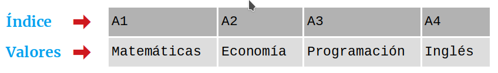
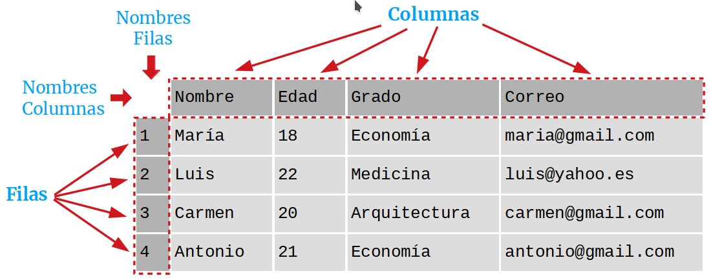

# 6. Manipulación de datos

## Índice

[1. Manejo de JSON](#1-manejo-de-json)  
[2. Librería pandas](#2-librería-pandas)  
[3. Librería matplotlib](#3-librería-matplotlib)

## 1. Manejo de JSON

Para cargar un JSON en un diccionario:

    import json

    x =  '{"name": "Unknown", "age": 99, "city": "Babylon"}'

    y = json.loads(x)

    print(y["age"])

Para convertir a JSON desde un diccionario:

    import json

    x = {
      "name": "John",
      "age": 30,
      "city": "New York"
    }

    y = json.dumps(x)

    print(y)

## 2. Librería pandas

Para instalar la librería:

    pip install pandas

Y para importarla (con alias):

    import pandas as pd

Esta líbrería aporta y maneja las siguientes estructuras de datos nuevas:

- **Series**

  Similares a las listas, pero homogéneas (del mismo tipo), con tamaño inmutable y con un índice asociado a cada elemento.

  

      s = pd.Series([1, 7, 2])

      print(s)

- **DataFrames**

  Conjunto de datos estructurado en forma de tabla donde cada columna es un objeto de tipo `Series` y las filas son registros que pueden contender datos de distintos tipos.

  Tiene dos índices, uno para las filas y otro para las columnas, con los que se acceden a sus elementos.

  

      import pandas as pd
      
      data = {
        'cars': ["BMW", "Volvo", "Ford"],
        'passings': [3, 7, 2]
      }

      df = pd.DataFrame(data)

      print(df)

Para importar un CSV:

    dfFromCsv = pd.read_csv('data/drake_data.csv')

    print(dfFromCsv.to_string())

O un JSON:

    dfFromJson = pd.read_json('data/drake_data.json')

    print(dfFromJson.to_string())

## 3. Librería matplotlib

Para instalar la librería:

    pip install numpy
    pip install matplotlib

Uso básico:

    import numpy as np
    import matplotlib.pyplot as plt

    xpoints = np.array([1, 8])
    ypoints = np.array([3, 10])

    plt.plot(xpoints, ypoints)
    plt.show()

## Referencias

[JSON](https://www.w3schools.com/python/python_json.asp)  
[Manipulación de datos con pandas](https://www.w3schools.com/python/pandas/default.asp)  
[Visualización de datos con matplotlib](https://www.w3schools.com/python/matplotlib_intro.asp)  
[La librería Pandas](https://aprendeconalf.es/docencia/python/manual/pandas/)  
[La librería Matplotlib](https://aprendeconalf.es/docencia/python/manual/matplotlib/)